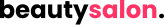
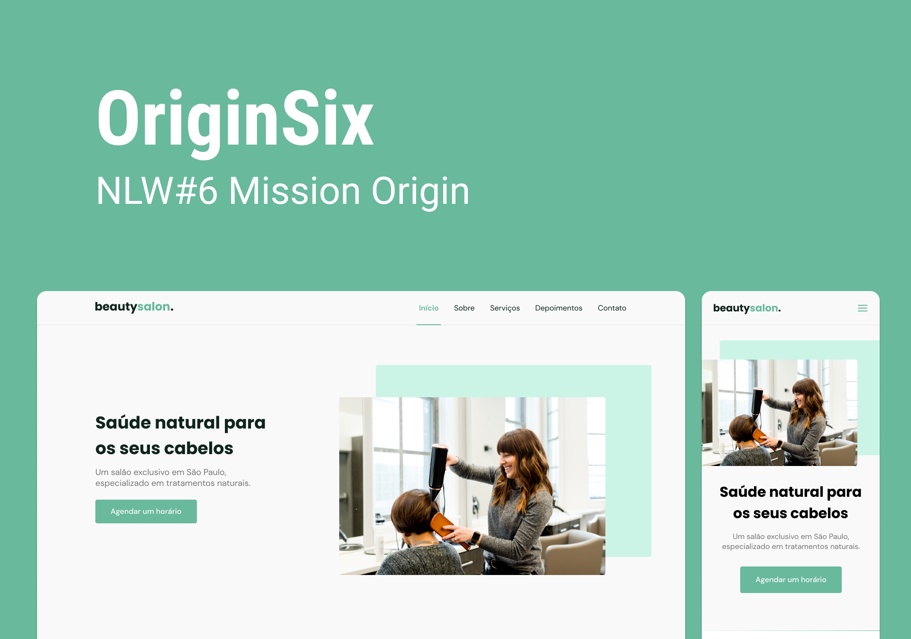

# Beauty Salon

Este projeto foi desenvolvido durante a missão Origin da NLW #6. E aqui está a minha execução.

## 💻️ Tecnologias Utilizadas
Neste projeto utilizei:

- HTML
- SCSS/SASS
- JavaScript

## 📝️ O Projeto
Este projeto consiste em uma landing page responsiva que trata de apresentar um salão de cabeleireiro chamado Beauty Salon.

## 🌐️ Como Acessar
Sendo uma pagina web é muito simples de ser acessada. Basta entrar [neste link](https://pedrohsfontoura.github.io/beautysalon) e ver o projeto no ar.

---

Feito de 💜️ por Pedro Fontoura
